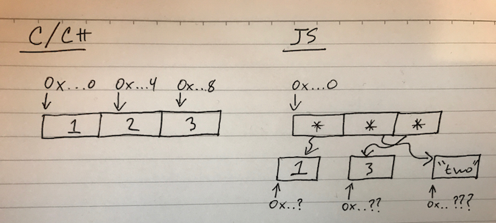

title: (Mis)adventures with JS Compilers
author:
  name: Nathan Epstein
  twitter: epstein_n
  url: http://nepste.in
  email: _@nepste.in

--
# (Mis)adventures with JS Compilers

--
### Pavlov.js

- AI library for JS (github.com/nathanepstein/pavlov.js)
- Initially written in ES5
- ... then re-written in ES6 (compiled w/ Babel)
- ... then re-written in C++ (compiled w/ Emscripten)

--

# Compiling to JavaScript

--

### Why compile to JS?

 - Platform ubiquity (web and otherwise) of JS.

 - Features / syntax / libraries / etc. of other languages.

 - Performance optimizations (maybe) from the compiler.

--

# Compiler Basics

--

### Compilers

- Compilers are used to write syntax in one language and convert it to another (possibly machine executable) computer language.

--

### AOT and JIT Compiling

- In some languages, high level syntax is compiled to a (possibly optimized) executable before runtime (ahead-of-time compiling).

- Other languages (like JavaScript) are JIT (just-in-time) compiled. This is a hybrid of interpretation and compilation (for heavily used pieces of code).

--

# Some JS Compilers

--
### Typescript

<table>
<td></td>

<td>
  <ul>
    <li>
      A strict superset of JavaScript.
    </li>
    <li>
      Adds optional static typing and class-based object-oriented programming.
    </li>
  </ul>
</td>

</table>
--

### Babel

<table>
<td>

</td>

<td>
<ul>
  
 Compiles ES6 to ES5 allowing for use of:

  <li> arrow functions </li>
  <li> classes </li>
  <li> block scoping </li>
  <li> "constants" </li>
  <li> and much more! </li>
</ul>
</td>
</table>
--

### Emscripten

<table>
<td>

</td>

<td>
  <ul>
    <li>
      Emscripten is an LLVM-to-JavaScript compiler.
    </li>
    <li>
      Allows for compilation from C / C++ / Rust to optimized JS.
    </li>
  </ul>
</td>
</table>
--

### CoffeeScript

<table>
<td>

</td>

<td>
  <ul>
    <li> A language that compiles to JS.</li>
    <li> Provides "nicer" sytanx.</li>
  </ul>
</td>
</table>
--

### ClojureScript

<table>
<td>

</td>

<td>
  <ul>
    <li> A compiler for Clojure which emits JS.</li>
    <li> Compatible with the advanced compilation mode of the Google Closure optimizing compiler.</li>
  </ul>

</td>
</table>
--

### Other Functional Compilers

- Scala.js compiles Scala to optimized JS.

- Several options for Haskell on their wiki under the "The JavaScript Problem".

--

# Compiling for Performance

--

### JS Performance

In some cases, we can use a compiler to generate more performant JavaScript then what we are able to produce with "hand written" JS.

--

### Some things that make JS "slow"

- layout of data in physical memory
- ambiguous functions
- garbage collection
- unoptimized code

--

### Memory Layout

- In a typed language, elements of an array / vector will typically be stored in contiguous memory.

- This is unlikely to happen in JS because array elements have different types / sizes.

--

### A Very Serious & Accurate Representation of Physical Memory

--

### Ambiguous Functions

- Functions with different argument types may have similar syntax but do very different things in physical memory (i.e. `let add = (a, b) => a + b;`).

--

### Garbage Collection

- Heap memory is not manually managed; may be reclaimed at unpredictable / undesirable times.

--

### Unoptimized Code
- "Hand written" code may contain room for optimizations that a compiler can perform (i.e. unnecessary computations and intermediate values, result reuse, memory locality, etc).

--

### Emscripten

- Allows us to compile LLVM-to-JS (C, C++, Rust).

- Can target WebAssembly or asm.js (optimizable low-level subset of JS).

- asm.js may be AOT or JIT compiled depending on browser.

--

### What Do We Get?

- Pre-emptive checks for type and linking errors.

- Libraries and syntax associated with the original language.

- **Sophisticated performance optimization that goes into the compiler.**

